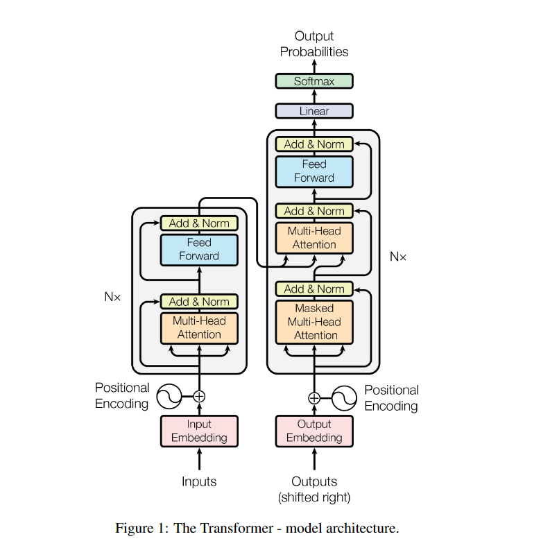
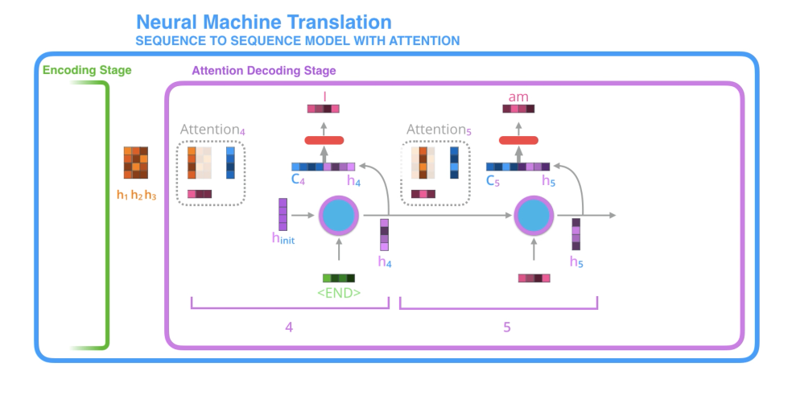
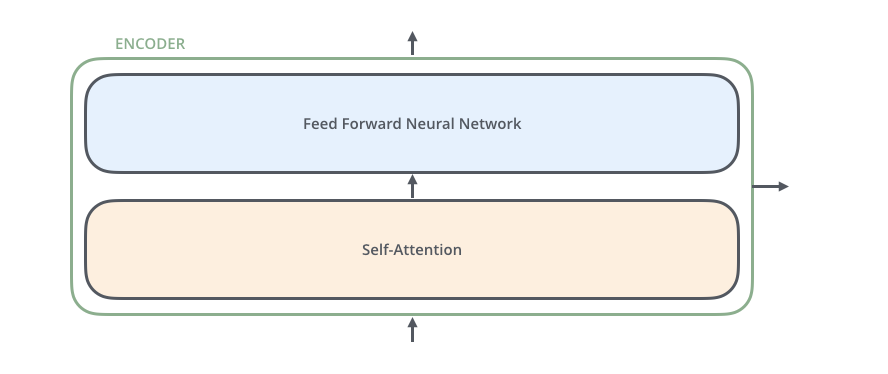
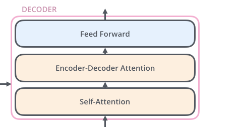
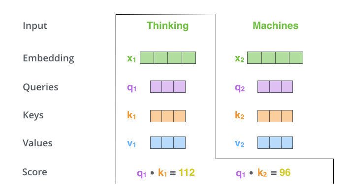
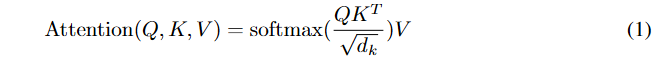
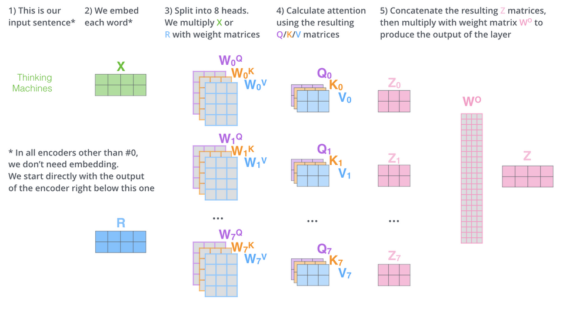
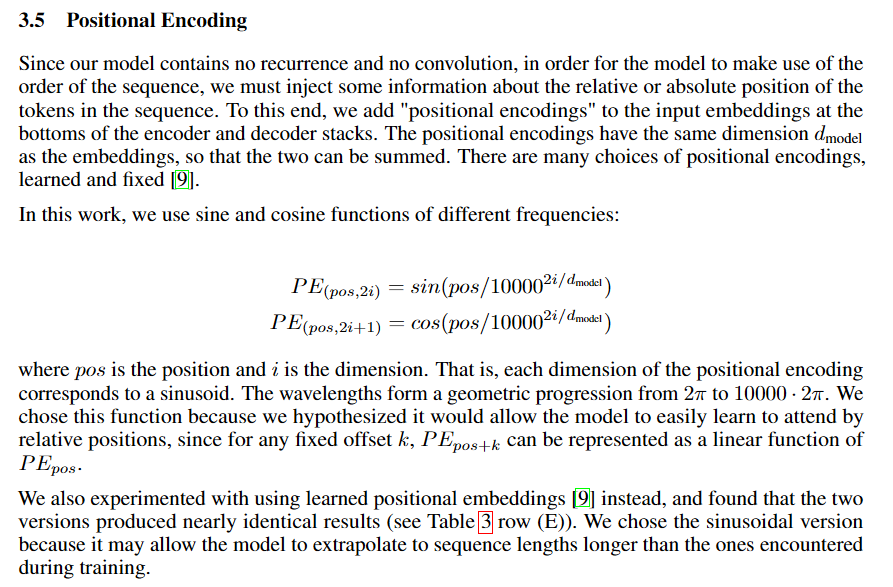

# Attention is all you need.


---

### Core Idea in One Sentence

hyperparameters and setup used in paper: 
encoder stack N = 6.
output dimension = 512
adam
8 p100
---

### The Problem

*What specific problem or limitation were the authors trying to solve? What was the state of the art before this paper?*
(1) first look at attention mechanism, comparing to previous pure RNN neural translation model:
- attention model passes all hidden states from encoder to the decoder
- the decoder: look at the set of hidden states it received, give each state a score, multiply each hidden state by its softmaxed score, which basically amplifies the states with the high scores, and finally sum up the weighted states to get the **context vector** for this time step
- detailed: 
    The attention decoder RNN takes in the embedding of the <END> token, and an initial decoder hidden state.
    The RNN processes its inputs, producing an output and a new hidden state vector (h4). The output is discarded.
    Attention Step: We use the encoder hidden states and the h4 vector to calculate a context vector (C4) for this time step.
    We concatenate h4 and C4 into one vector.
    We pass this vector through a feedforward neural network (one trained jointly with the model).
    The output of the feedforward neural networks indicates the output word of this time step.
    Repeat for the next time steps
 

- the cost of learning dependency between distant words is reduced to constant
---

### The How

*In bullet points, what are the key components of their proposed solution? Explain them simply, as if you were teaching a colleague.*

(2) Transformer architecture:
- encoder structure: 
- decoder structure: 
- encoder receives word embedding or previous output as input. The size of this list is hyperparameter we can set – basically it would be the length of the longest sentence in our training dataset
- the decoder receives the whole encoder output and sos for the first step, after that it gets previous output and the whole context
- self - attention: 
1. create three vectors from the word embedding, Query, Key and Value. The weight matrix are usually smaller in order the make the computation of multihead attention constant.
2. Each position of word calculates a score for each word in the sentence . By taking dot product of the query of the position word and the key of the other word in question:   
3. divide the score by the square root of the dimension of the key vectors used in paper to have more stable gradient. Then pass through a softmax. 
4. multiply value vector by the softmax score.
5. sum up the weighted value vectors. This produces the final context vector.

6. Multihead attention mechanism: basically runs 8 different self attention in pararell, after training concats the result into a single matrix, then go through another trained weight matrix to get the context vector.
Summary: 
7. We add a positional encoding to preserve order information.
8. method for position encoding: 

- On the decoder output layer, the vector pass through a full layer, softmaxed, size of this vector matches the size of the word bank of the model. 

- in the decoder, after the attention score is calculated and before the softmax, we have a mask matrix to make everything after the current token 0. 
- The decoder's self attention layer works the same as encoder.
- Decoder's encoder-decoder attention layer has its Query vector from the self attention layer output, and the Key and Value vector from the final output of the encoder, representing the whole input sentence. 
(3) Loss function: cross entropy

greedy decoding and beam search (try the two with highest distribution, and select one)
---

### The Results & Proofs

*What are the 1-3 key graphs, tables, or results that prove their solution works? What metrics did they use? add screenshots if needed*


---

### The Questions 

*What parts are confusing? Do I agree with their assumptions? What are the limitations or potential failure modes?*

1. why is the masking necessary

---

### The Connections

*How does this relate to other papers I've read? Does it build on, refute, or propose an alternative to a previous idea?*


---

###  The Vocabulary & Concepts

*List and define any new terms learned from this paper.*


---

### The Codes

*Are there any interesting implementation details? Can I link to an official or unofficial implementation? Can I write a small code snippet to demonstrate the core idea?*

  ```python

  ```