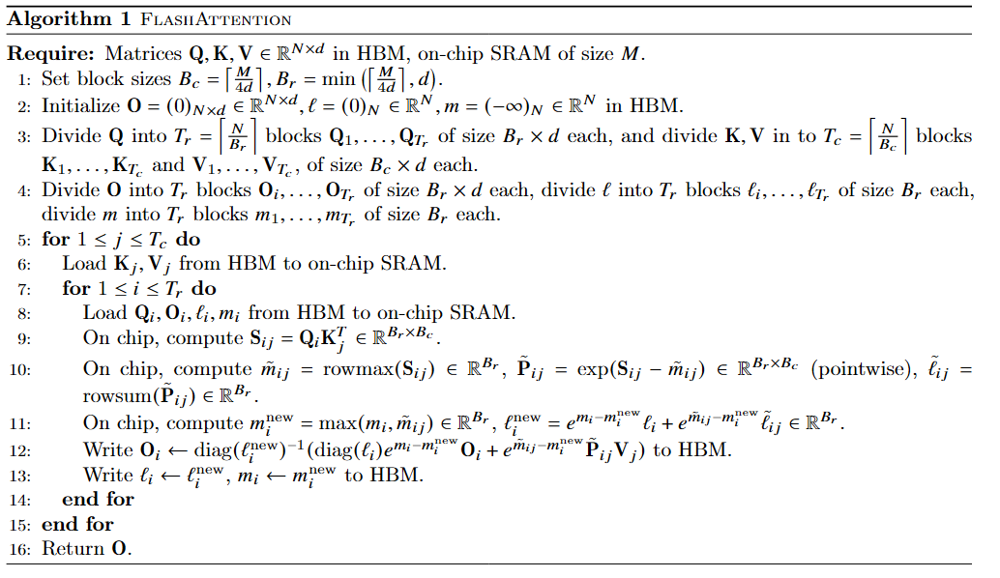

# FlashAttention: Fast and Memory-Efficient Exact Attention with IO-Awareness

---

### Core Idea in One Sentence


---

### The Problem

*What specific problem or limitation were the authors trying to solve? What was the state of the art before this paper?*

They argue that current optimization for attention algorithm have reduced compute to linear, but they do not display wall-clock speedup also no wide adoption. Reason is that they only focus on FLOP reduction. 

---

### The How

*In bullet points, what are the key components of their proposed solution? Explain them simply, as if you were teaching a colleague.*
- main goal is to avoid reading and writing the attention matrix to and from HBM.
- use tiling
- matrix multiplication are compute bound, others are memory bound
- Algorithm:
  1. 
---

### The Results & Proofs

*What are the 1-3 key graphs, tables, or results that prove their solution works? What metrics did they use? add screenshots if needed*
FlashAttention trains Transformers faster than existing baselines: 15% end-to-end wall-clock speedup
on BERT-large (seq. length 512) compared to the MLPerf 1.1 training speed record, 3 speedup on
GPT-2 (seq. length 1K), and 2.4 speedup on long-range arena (seq. length 1K-4K). FlashAttention
and block-sparse FlashAttention enable longer context in Transformers, yielding higher quality models
(0.7 better perplexity on GPT-2 and 6.4 points of lift on long-document classification) and entirely new
capabilities: the first Transformers to achieve better-than-chance performance on the Path-X challenge
(seq. length 16K, 61.4% accuracy) and Path-256 (seq. length 64K, 63.1% accuracy)

---

### The Questions 

*What parts are confusing? Do I agree with their assumptions? What are the limitations or potential failure modes?*


---

### The Connections

*How does this relate to other papers I've read? Does it build on, refute, or propose an alternative to a previous idea?*


---

###  The Vocabulary & Concepts

*List and define any new terms learned from this paper.*


---

### The Codes

*Are there any interesting implementation details? Can I link to an official or unofficial implementation? Can I write a small code snippet to demonstrate the core idea?*

  ```python

  ```