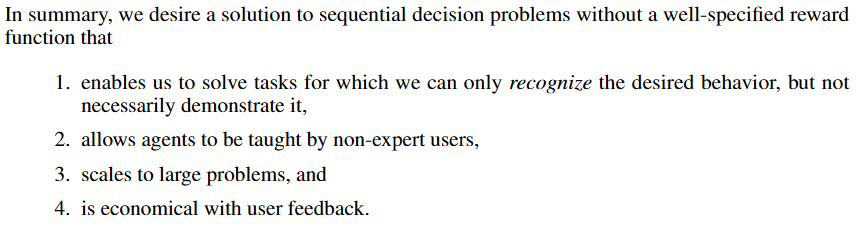
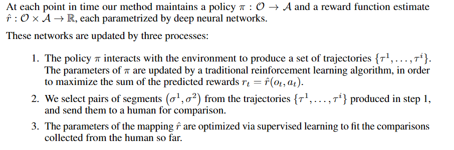

# Deep Reinforcement Learning from Human Preferences

---

### Core Idea in One Sentence


---

### The Problem

*What specific problem or limitation were the authors trying to solve? What was the state of the art before this paper?*

- Reward functions are not always available 
- One approach would be having demonstrations of the desired task and use inverse RL. But some tasks are hard for human to demonstrate.
- Human feedback is good, but needs reduction of work by orders of magnitude to make it work efficiently.
---

### The How

*In bullet points, what are the key components of their proposed solution? Explain them simply, as if you were teaching a colleague.*
- goal: To learn a reward function from human preference, then optimize it. 

- training process:


---

### The Results & Proofs

*What are the 1-3 key graphs, tables, or results that prove their solution works? What metrics did they use? add screenshots if needed*


---

### The Questions 

*What parts are confusing? Do I agree with their assumptions? What are the limitations or potential failure modes?*


---

### The Connections

*How does this relate to other papers I've read? Does it build on, refute, or propose an alternative to a previous idea?*


---

###  The Vocabulary & Concepts

*List and define any new terms learned from this paper.*


---

### The Codes

*Are there any interesting implementation details? Can I link to an official or unofficial implementation? Can I write a small code snippet to demonstrate the core idea?*

  ```python

  ```